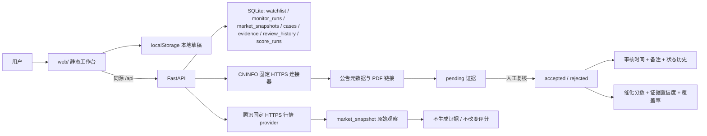

# A-Share Catalyst Lens 接手与运行手册

> 更新日期：2026-07-15
> 当前 API 版本：`0.5.0`
> 仓库：<https://github.com/dongpen-max/A-Share-Catalyst-Lens>
> 静态站点：<https://dongpen-max.github.io/A-Share-Catalyst-Lens/>

这份文档专门用于在新 Codex 对话、新终端或隔一段时间后快速接手项目。进程是短暂状态，不要假设本地 API 仍在运行；每次接手都先做健康检查。

## 新对话直接粘贴

```text
请接手 A-Share Catalyst Lens 项目。

本机仓库：
C:\Users\ZhuanZ1\Documents\GITHUB开源项目\A-Share-Catalyst-Lens

请先阅读 HANDOFF.md、README.md 和 PRODUCT.md，然后：
1. 运行 git status --short --branch 和 git log -3 --oneline，不要覆盖现有未提交修改。
2. 请求 http://127.0.0.1:8000/api/health；若不通，用 .\.venv\Scripts\python.exe -m server 启动。
3. 运行 Python 和 Node 测试，记录当前基线。
4. 保持产品不变式：自动证据默认 pending，只有 accepted 证据参与评分；不宣称股价预测准确率；不自动抓取用户输入的任意 URL。
5. 继续完成下面的当前任务，实施、测试、视觉检查后再汇报。

当前任务：[在这里填写]
```

## 当前产品状态

- `main` 是主分支；当前工作分支代码基线为 `v0.5 Review Audit + Catalyst Watch Phase 2`。
- 网站是零前端框架的 HTML/CSS/JavaScript PWA。
- 本地后端是 FastAPI + SQLite，官方公告连接器是巨潮资讯 CNINFO，手动行情 provider 是腾讯财经固定 HTTPS 单股接口。
- GitHub Pages 只发布 `web/`，因此保留手动证据和浏览器本地自选股，不会运行 Python API。
- 本地从 FastAPI 打开网站时，同时支持自动发现、手动输入、手动刷新行情和 SQLite 持久化。
- 自动发现结果默认为 `pending`，用户必须核对原文后才能改为 `accepted`。
- 已分离展示催化强度、证据置信度和资料覆盖率，它们都不是未来收益概率。
- Catalyst Watch Phase 2 在自选股地基上增加手动行情刷新：只有用户点击按钮才请求 provider，行情快照是原始观察，不生成证据，也不改变评分。
- 静态模式仍使用独立 `localStorage` 管理自选股，不请求行情；混合模式以 SQLite 为自选股和行情记录的权威来源。

2026-07-15 验证基线：

- Python：43 项测试通过。
- Node：9 项测试通过。
- 4 个网页 JavaScript 文件语法检查、严格样例和 `git diff --check` 通过。
- 1440px、900px 和 390px 浏览器检查无水平溢出，控制台 0 错误、0 警告。
- Python 测试会出现 Starlette `TestClient/httpx` 弃用警告，当前不影响通过。
- 终端进程不属于仓库状态，每次都应重新检查 API。

## 一分钟启动

### Windows PowerShell

```powershell
Set-Location "C:\Users\ZhuanZ1\Documents\GITHUB开源项目\A-Share-Catalyst-Lens"

if (-not (Test-Path ".\.venv\Scripts\python.exe")) {
    py -3.12 -m venv .venv
}

.\.venv\Scripts\python.exe -m pip install -r requirements.txt
.\.venv\Scripts\python.exe -m server
```

保持该终端运行，然后打开：

- 完整工作台：<http://127.0.0.1:8000>
- API 健康检查：<http://127.0.0.1:8000/api/health>
- OpenAPI 文档：<http://127.0.0.1:8000/docs>

健康检查应返回类似：

```json
{"status":"ok","version":"0.5.0","database":"sqlite","connectors":["cninfo"],"market_provider":"tencent","mode":"local-first"}
```

使用 `Ctrl+C` 停止服务。不必激活虚拟环境，直接调用 `.venv` 里的 Python 可避免 PowerShell 执行策略问题。

### 只运行手动模式

可直接访问 GitHub Pages，或在仓库根目录运行：

```powershell
python -m http.server 8000 --directory web
```

静态模式下“自动发现”和“刷新盯盘”按钮必须是禁用状态，这是运行边界，不是股票代码或页面故障。静态自选股仍可在浏览器本地增删、启停、排序和持久化。

## 模式判断与排障

| 页面状态 | 原因 | 处理 |
|---|---|---|
| `正在检测运行模式` | 正在请求 `./api/health` | 等待数秒；长时间不变则检查控制台和 Service Worker |
| `本地手动模式` | GitHub Pages、静态服务器或 API 不可达 | 用 `python -m server` 启动，并访问精确地址 `127.0.0.1:8000` |
| `混合模式 v0.5.0` | FastAPI 健康检查通过 | 可使用自动发现、手动行情刷新和审核历史 |
| 服务已启动但按钮仍禁用 | 打开了 Pages/PWA 旧页面，或旧缓存未更新 | 确认地址栏，按 `Ctrl+F5`，必要时清除该站点的 Service Worker |
| 自动发现返回 0 条 | 日期、关键词或代码不匹配，或 CNINFO 短暂限流 | 先去掉关键词、扩大日期范围，再与巨潮官网手动结果对照 |

端口被占用时：

```powershell
Get-NetTCPConnection -LocalPort 8000 -ErrorAction SilentlyContinue
$env:CATALYST_PORT = "8010"
.\.venv\Scripts\python.exe -m server
```

如果改用 `8010`，页面也必须从 `http://127.0.0.1:8010` 打开。

## 最小功能验收

1. 打开 `/api/health`，确认 `status` 为 `ok`、版本为 `0.5.0`，且 `market_provider` 为 `tencent`。
2. 从 FastAPI 首页打开网站，确认显示“混合模式”。
3. 添加、启停、排序和删除 6 位 A 股代码，确认重复添加不产生重复项，重启 SQLite 后仍保留。
4. 点击“刷新盯盘”，确认只刷新已启用自选股，并显示价格、涨跌幅、成交量、成交额、来源时间、时效和数据质量。
5. 检查 `/api/monitor/runs` 与 `/api/monitor/snapshots`，确认单股失败不会阻断整批，`unavailable` 记录保留审计但不覆盖最后可用快照。
6. 确认行情刷新没有生成 evidence、没有改变任何评分，也没有调度、通知或 LLM 行为。
7. 输入 6 位 A 股代码，设置日期范围，点击“自动发现”，确认新证据都进入“待审核”，没有自动影响评分。
8. 打开公告原文，人工核对后采纳一条，确认置信度和覆盖率更新。
9. 为采纳或排除填写审核备注，确认卡片、API 和导出结果保留完整状态历史。
10. 从静态服务器打开网页，确认自选股仍保存在 `localStorage`，且不会请求任何 `/api/monitor/*` 路径。
11. 检查中文标题、引文和报告没有乱码。PowerShell 终端的乱码不等于 API 返回错误，应以浏览器或 `curl.exe` 原始响应复核。

## 架构和数据流



关键数据规则：

- 案例保存股票代码、公司、事件、日期和检索词。
- 自选股严格校验 6 位 ASCII 数字代码；静态模式保存到独立 `localStorage`，混合模式保存到 SQLite。
- 手动刷新只遍历已启用自选股，腾讯请求 symbol 由服务端根据已校验代码生成，不接受用户 URL 或任意抓取目标。
- `monitor_runs` 保存运行状态和逐股计数；`market_snapshots` 保存价格、涨跌幅、成交量、成交额、来源时间、过期状态、质量和缺失字段。
- `POST /api/monitor/refresh` 只接受 JSON `{}`；`GET /api/monitor/latest` 返回最近运行和最后可用快照。
- `GET /api/monitor/runs` 返回运行历史；`GET /api/monitor/snapshots` 支持按运行或股票代码复核原始快照。
- 服务商北京时间转换为 UTC；严格超过 900 秒才标记过期。`unavailable` 快照保留审计、计为失败，但不覆盖最后可用快照。
- 逐股错误保留原始自选股 ID；异常数值降级为缺失，单股 provider 异常不阻断整批，存储异常尽力将 run 收敛到终态后继续向调用方报错。
- 行情快照与证据分层；Phase 2 不创建 finding 或 evidence，任何快照都不能直接参与评分。
- 证据来源是 `automatic` 或 `manual`，审核状态是 `pending` / `accepted` / `rejected`。
- 同一案例按“来源名 + URL + 标题”的内容哈希去重。
- 只有 `accepted` 证据进入推导评分。
- 手动证据默认已采纳，自动证据默认待审核。
- 状态或审核备注变化会追加到 `evidence_review_history`；普通内容编辑不会制造审核记录。
- 手动 URL 只存储，后端不请求该地址，以避免 SSRF。
- SQLite 默认位于 `data/catalyst.db`，已被 `.gitignore` 排除；它不会被 Git 备份。

## 关键文件

| 路径 | 作用 |
|---|---|
| `web/app.js` | 网页状态、API 检测、证据审核、导入导出 |
| `web/evidence.js` | 浏览器证据推导、置信度和覆盖率 |
| `web/scoring.js` | 浏览器催化评分内核 |
| `server/app.py` | FastAPI 路由、安全边界和静态托管 |
| `server/services/cninfo.py` | CNINFO 公司解析和公告检索 |
| `server/services/market.py` | 腾讯固定 HTTPS 行情请求、字段归一化、时区和质量判断 |
| `server/database.py` | SQLite 建表、兼容迁移、自选股、行情快照、去重、审核历史和持久化 |
| `server/scoring.py` | 已采纳证据的推导和三类分数 |
| `server/models.py` | API 输入类型、长度、枚举和 0-5 范围校验 |
| `docs/MONITORING_INTEGRATION.md` | Catalyst Watch 数据流、分阶段契约与不变式 |
| `SKILL.md` | Codex Skill 工作流和分析不变式 |
| `PRODUCT.md` | 用户、产品边界、品牌和可访问性原则 |
| `tests/` | API、评分和 Python/JavaScript 一致性测试 |

## 完整验证命令

```powershell
.\.venv\Scripts\python.exe -m unittest discover -s tests

node --check web/scoring.js
node --check web/evidence.js
node --check web/app.js
node --check web/sw.js
node --test tests/test_web_scoring.js tests/test_web_evidence.js

.\.venv\Scripts\python.exe scripts/catalyst_score.py examples/events.json --pretty --strict
git diff --check
git status --short --branch
```

API 单元测试使用临时 SQLite、假连接器和假行情 provider，不依赖外网。修改 CNINFO 或腾讯行情适配时，除了单元测试，还应分别做一次真实公告或行情冒烟测试，但不要把外网测试放进必过 CI。

## 发布边界

- `.github/workflows/ci.yml` 在 push 和 pull request 时运行 Python/Node 验证。
- `.github/workflows/pages.yml` 只在 `web/**` 或工作流本身变更时发布静态网站。
- FastAPI 当前没有部署到公网，GitHub Pages 上禁用自动发现是预期行为。
- 如果要让在线站点支持自动发现，必须另行部署 API，并同时处理数据库、认证、限流、CORS、日志、隐私和数据源条款；不应把当前未认证的 SQLite 服务直接暴露到公网。

## 已知限制

1. CNINFO 目前主要返回公告元数据和 PDF 链接，尚未自动抽取 PDF 页码、引文和关键数字。
2. 自动连接器主要覆盖沪深 A 股，北交所、港股和中概股仍以手动证据为主。
3. Catalyst Watch Phase 2 只有腾讯单一行情 provider，定位为本地低频、best-effort 数据；尚无 fallback、熔断、重试、交易日判断、运行锁或调度器。
4. 腾讯接口字段和可用性可能变化，当前通过字段校验、质量标记和最后可用快照降低误读，但不承诺交易终端级实时性或完整性。
5. 行情只有手动快照，尚无 `monitor_finding`、阈值异常或盯盘证据；不会自动生成证据，也不会影响评分。
6. 静态 GitHub Pages 不运行 Python，因此不会刷新行情、自动发现或保存服务端运行历史；静态自选股和手动证据仍可本地使用。
7. 没有用户认证、多租户隔离、公网限流和秘钥管理，后端定位仍是本机工具。
8. SQLite 建表使用内置 `CREATE TABLE IF NOT EXISTS` 和兼容迁移，尚无正式数据库迁移和备份恢复流程。
9. `score_runs` 保存了评分快照，但前端还没有历史复盘界面；审核状态与备注已有历史，证据内容字段仍没有完整版本日志。
10. 公告标题关键词检索可能漏召回，单一数据源不应被视为完整信息集。
11. 没有建立标注数据集，当前不能客观报告召回率、方向分类准确率和引文准确性。
12. 已存在服务端的证据若在 `PATCH` 失败后离线审核，结果只保留在当前浏览器；尚无操作队列按顺序重放中间审核动作，不能用简单 dirty 标记替代，刷新远端数据前应避免覆盖未同步审核。

## 改进建议

### P0：先让运行和故障更可见

1. 在静态模式的禁用按钮旁显示“如何启用自动发现”，而不是只依赖鼠标悬浮提示。
2. 新增 `scripts/dev.ps1` 和 `scripts/dev.sh`，完成环境检查、安装、启动、健康检查和打开页面。
3. 增加结构化日志和更明确的 CNINFO 错误类型，区分无结果、代码不支持、超时、限流和上游格式变更。
4. 固定可复现的依赖锁文件，并消除 Starlette `TestClient/httpx` 弃用警告。

### P1：提升“证据自动化”的实际价值

1. 只从允许的官方域名下载 CNINFO PDF，抽取页码、原文引文、关键数字和文件哈希，扫描件再使用 OCR。抽取结果仍必须是 `pending`。
2. 建立证据排序器，综合官方程度、时间、关键词相关性、重复度和事件类型，但不把排序分当作股价胜率。
3. 在 Phase 2 原始快照之上增加透明、可复核的异常规则，只把命中结果转换为待审核证据。
4. 对同一事件进行聚类，避免多家转载被错认为多源独立确认。

### P1：如需在线自动发现，重做部署边界

1. 前端支持可配置 API Base URL，不再只依赖同源 `./api`。
2. 将生产数据从本地 SQLite 迁移到托管 PostgreSQL，引入数据库迁移、备份和恢复。
3. 加入用户认证、案例所有权校验、请求限流、审计日志、安全头和监控告警。
4. 确认 CNINFO 和行情数据源的使用条款，避免把对本机研究可用的调用方式直接放大为公共抓取服务。

### P2：用可测量质量取代“准确率”口号

1. 建立经人工标注的 A 股事件证据集，分开评估公告召回率、Precision@K、事件方向一致性、引文可追溯率和审核者一致性。
2. 对每次证据规则或模型变更运行回归评测，记录版本、输入和失败案例。
3. 如引入 LLM，必须保留模型版本、提示词版本、原文页码和人工审核状态，并防御公告文本中的提示注入。
4. 不用短期涨跌作为唯一标签；股价表现可用于复盘，不能证明某条事件分析必然正确。

### P2：增强复盘和数据可迁移性

1. 在现有审核历史上增加证据内容版本和离线操作队列，并与评分快照组成时间线。
2. 在网页中展示 `score_runs`，可对比两次评分为什么变化。
3. 新增案例级备份/恢复、数据库导出和版本化 JSON Schema。

## 建议的下一个里程碑

`Catalyst Watch Phase 3: 异常转换为待审核证据`：

1. 新增透明的 `monitor_finding` 层，首批只做涨跌幅阈值和成交量异常，不调用 LLM。
2. 规则命中时由 finding 转换为 `origin=automatic`、`source_type=market_data`、`status=pending` 的 evidence。
3. 证据必须带快照 ID、provider、来源时间、规则阈值和稳定去重键，保留从证据回溯到原始观察的完整路径。
4. 新证据在人工改为 `accepted` 前不得参与评分；`pending` 和 `rejected` 永远不影响评分。
5. 本阶段仍不引入定时任务、通知、交易动作或 LLM，并保持静态 GitHub Pages 的手动能力。

完整融合契约见 `docs/MONITORING_INTEGRATION.md`。

## 每次交付检查清单

- 先阅读现有修改，不回退用户或其他任务留下的变更。
- 修改评分时，同步更新 Python、JavaScript 和跨语言一致性测试。
- 修改 API 时，覆盖成功、校验错误、去重、审核状态和数据库连接关闭。
- 修改前端时，同时检查静态手动模式和 FastAPI 混合模式。
- 修改 PWA 资源时，升级 Service Worker 缓存版本并运行离线回归。
- 修改界面时，检查桌面端和 390px 移动端，确保无水平溢出、文字裁切和焦点丢失。
- 完成后运行全部测试、`git diff --check` 和 `git status`，再提交、推送并核对 CI/Pages。
- 汇报时明确写出运行地址、测试数量、已知限制和未完成事项。
