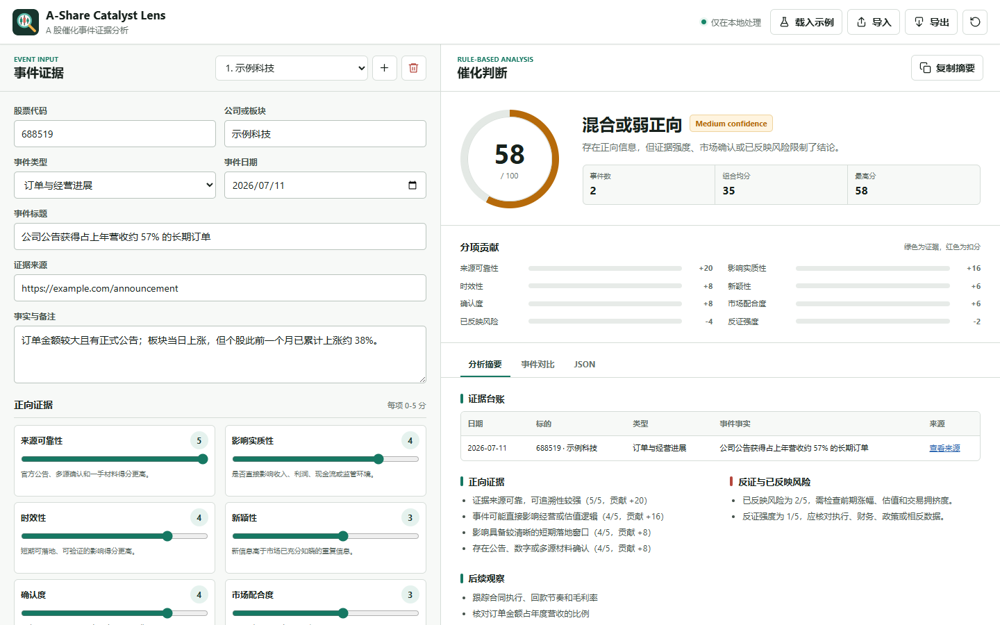

# A-Share Catalyst Lens

面向中国 A 股和中国相关股票的 Codex Skill 与证据工作台，用于把新闻、公告、政策、资金流、板块题材和价格成交行为整理成可追溯的“利好/利空催化分析”。网站既可作为纯浏览器手动工具运行，也可连接本地 FastAPI 服务自动检索巨潮资讯公告。

它不会承诺预测股价，也不会给出确定性交易指令。它的目标是帮助你把分散信息拆成事实、推理、反证、市场确认和失效条件，并用统一框架给出催化强度、证据置信度、资料覆盖率和后续观察清单。

> 需要在新对话或新终端中继续开发？先阅读 [HANDOFF.md](HANDOFF.md)，其中包含可直接粘贴的接手提示词、一分钟启动步骤、排障和分级改进路线。



## 适合什么场景

- 判断某条 A 股新闻到底是利好、利空、混合影响，还是证据不足。
- 分析政策、行业标准、地方补贴、监管变化对板块或个股的影响。
- 解读公司公告、业绩预告、订单合同、回购分红、并购重组、产品获批等事件。
- 检查涨停、连板、放量、换手、板块轮动等市场行为是否支持新闻逻辑。
- 将公开信息整理成一份带引用、带反证、带置信度的中文研究摘要。
- 对结构化事件证据进行 0-100 分催化强度评分。

## 核心能力

- 证据优先：先查公告、交易所、监管机构、公司 IR、权威媒体和市场数据，再给判断。
- 事件台账：区分事实、来源、影响通道、市场反应、反证和缺失信息。
- 催化分类：覆盖政策、业绩、订单、回购、分红、并购、产品获批、资金流、板块题材和传闻。
- 利好评分：从来源可靠性、影响实质性、时效性、新颖性、确认度、市场配合度、是否已反映和反证强度综合打分。
- 自动发现：按股票代码、日期和关键词检索巨潮资讯，自动去重并保存来源链接。
- 催化盯盘：手动刷新自选股行情，用透明规则标记涨跌幅和可比成交量异常；匹配当前事件时只生成待审核证据。
- 人工审核：自动结果只进入待审核区，采纳前不会影响评分；采纳、排除和备注变化均保留时间与状态历史。
- 三类指标分离：分别展示催化强度、证据置信度和资料覆盖率，避免把它们包装成一个“准确率”。
- 渐进增强：GitHub Pages 保留完整手动能力，连接本地服务后再开放自动检索和 SQLite 持久化。
- 风险约束：明确指出已经 price-in、估值拥挤、执行风险、监管不确定性和财务质量问题。
- 中文输出：默认适配中文 A 股分析语境，同时保留英文命令和字段，方便脚本化。

## 仓库结构

```text
A-Share-Catalyst-Lens/
├── .github/
│   └── workflows/
│       ├── ci.yml
│       └── pages.yml
├── HANDOFF.md
├── LICENSE
├── PRODUCT.md
├── requirements.txt
├── SKILL.md
├── agents/
│   └── openai.yaml
├── examples/
│   └── events.json
├── docs/
│   └── MONITORING_INTEGRATION.md
├── references/
│   ├── catalyst-rubric.md
│   └── data-sources.md
├── scripts/
│   └── catalyst_score.py
├── server/
│   ├── app.py
│   ├── database.py
│   ├── models.py
│   ├── scoring.py
│   └── services/
│       ├── cninfo.py
│       ├── findings.py
│       └── market.py
├── tests/
│   ├── test_api.py
│   ├── test_catalyst_score.py
│   ├── test_evidence_parity.py
│   ├── test_scoring_parity.py
│   ├── test_market_provider.py
│   ├── test_monitor_findings.py
│   ├── test_web_evidence.js
│   └── test_web_scoring.js
└── web/
    ├── assets/
    │   ├── icon-192.png
    │   ├── icon-512.png
    │   ├── lens-mark.svg
    │   └── preview.png
    ├── app.js
    ├── evidence.js
    ├── index.html
    ├── manifest.webmanifest
    ├── scoring.js
    ├── sw.js
    └── styles.css
```

文件说明：

- `.github/workflows/ci.yml`：GitHub Actions 自动验证 Python/JavaScript 语法、单元测试和示例评分。
- `.github/workflows/pages.yml`：将 `web/` 静态网站自动发布到 GitHub Pages。
- `HANDOFF.md`：新对话接手提示词、本地运行手册、排障和改进路线。
- `LICENSE`：MIT 开源许可证。
- `PRODUCT.md`：产品边界、目标用户、设计原则和无障碍约束。
- `requirements.txt`：本地 API 服务依赖。
- `SKILL.md`：Codex Skill 主入口，定义触发条件、工作流、资源和验证规则。
- `agents/openai.yaml`：Skill 在 Codex 界面中的展示名称、简介和默认提示词。
- `examples/events.json`：可直接运行的结构化事件评分示例。
- `docs/MONITORING_INTEGRATION.md`：Catalyst Watch 数据流、分阶段契约和产品边界。
- `references/catalyst-rubric.md`：催化事件台账、分类、评分规则和报告模板。
- `references/data-sources.md`：A 股分析的数据源优先级、实用选择和上下文检查清单。
- `scripts/catalyst_score.py`：对结构化事件 JSON 进行确定性评分的辅助脚本。
- `server/`：FastAPI、SQLite、巨潮资讯连接器、手动行情 provider 和证据评分服务。
- `tests/`：API、Python/JavaScript 评分内核及跨语言一致性测试。
- `web/`：零前端依赖网站，支持证据审核、多事件、实时评分、导入导出和本地自动保存。

## 网站版

网站提供一个双栏 A 股催化分析工作台，支持：

- 同时管理多条关联事件并比较分数。
- 管理自选股的添加、启停和排序，与事件评分独立。
- 在本地混合模式点击“刷新盯盘”，查看带来源时间、时效和缺失字段的行情快照。
- 查看透明规则的观测值、阈值和成交量历史基线；点击刷新时，匹配当前事件的命中项才自动进入待审核证据。
- 自动检索公司公告，并按状态查看待审核、已采纳和已排除证据。
- 手动录入公告、市场数据、同行对照、权威媒体和反证材料。
- 查看每条证据的来源、日期、方向、原文引文、可靠性和相关性。
- 实时查看总分、置信度、分项贡献和风险扣分。
- 单独查看证据置信度、资料覆盖率和五类覆盖缺口。
- 自动生成证据台账、正向逻辑、反证和后续观察清单。
- 导入、导出 JSON，复制或下载 Markdown 分析报告。
- 使用浏览器本地存储自动保存草稿；全栈模式还会写入本机 SQLite。
- 可安装为桌面/移动端应用；成功在线打开一次后可离线使用。

### 两种运行模式

| 模式 | 启动方式 | 自动发现 | 手动刷新行情 | 手动证据 | 数据位置 |
|---|---|---:|---:|---:|---|
| 浏览器本地模式 | GitHub Pages 或静态服务器 | 否 | 否 | 是 | 浏览器 `localStorage` |
| 本地混合模式 | `python -m server` | 是 | 是 | 是 | 浏览器 + 本机 SQLite |

两种模式都可以使用自选股。浏览器本地模式保存到独立 `localStorage`，本地混合模式以 SQLite 为唯一权威来源。行情只在用户点击按钮后由本地 API 请求；快照仍是原始观察，规则命中先形成 finding，转换结果必须保持 `automatic + pending`，采纳前不改变评分。

自动发现并不是自动采信。所有自动结果初始状态均为 `pending`；只有用户改为 `accepted` 后，才会参与证据置信度、覆盖率和推导评分。`rejected` 证据会保留在台账中，但不参与计算。

#### 浏览器本地模式

直接打开 [`web/index.html`](web/index.html) 即可使用。也可以在仓库根目录运行静态服务：

```bash
python -m http.server 8000 --directory web
```

然后访问 `http://localhost:8000`。

GitHub Pages 工作流会尝试发布到：

https://dongpen-max.github.io/A-Share-Catalyst-Lens/

在支持 PWA 的浏览器中，页面顶部会在满足条件时显示“安装应用”。离线缓存只包含网站静态资源；事件草稿仍存放在当前浏览器的本地存储中。

#### 本地混合模式

```bash
python -m venv .venv
```

Windows PowerShell：

```powershell
.\.venv\Scripts\Activate.ps1
python -m pip install -r requirements.txt
python -m server
```

macOS/Linux：

```bash
source .venv/bin/activate
python -m pip install -r requirements.txt
python -m server
```

然后访问 `http://127.0.0.1:8000`。服务默认只监听本机回环地址，数据库默认写入 `data/catalyst.db`。可通过以下环境变量修改：

| 环境变量 | 默认值 | 作用 |
|---|---|---|
| `CATALYST_HOST` | `127.0.0.1` | API 监听地址 |
| `CATALYST_PORT` | `8000` | API 端口 |
| `CATALYST_DB_PATH` | `data/catalyst.db` | SQLite 文件路径 |
| `CATALYST_ALLOWED_ORIGINS` | 空 | 额外允许的跨域来源，逗号分隔 |

### 证据工作流

1. 填写 6 位股票代码、事件标题和日期范围。
2. 点击“自动发现”，或使用“手动添加”录入自己的材料。
3. 打开原文核对标题、日期、引文、方向和评分字段。
4. 将可信材料设为“已采纳”，将无关或错误材料设为“已排除”。
5. 补充市场数据、同行对照和反证，直到覆盖率缺口足够清晰。
6. 如需修正模型推导，移动评分滑块；可随时恢复“采用证据推导值”。

### 三类分数

| 指标 | 回答的问题 | 主要输入 |
|---|---|---|
| 催化分数 | 事件本身偏正向还是偏负向，强度如何？ | 八个催化维度及风险扣分 |
| 证据置信度 | 当前已采纳材料有多可信、相关、新鲜和可引用？ | 可靠性、相关性、新鲜度、来源多样性、链接和引文 |
| 资料覆盖率 | 关键证据类别是否齐全？ | 官方来源、经营影响、市场数据、同行对照、反证 |

这些分数用于暴露依据和缺口，不表示预测胜率，也不应被解读为未来收益概率。

### 数据与安全边界

- 自动连接器只访问固定的巨潮资讯 HTTPS 接口；手动行情只访问由服务端生成 symbol 的腾讯固定 HTTPS 接口，均不接受用户指定抓取目标。
- 手动输入的 URL 只作为引用保存，服务端不会主动请求该 URL，避免任意 URL 抓取风险。
- 默认服务只监听 `127.0.0.1`，不会主动暴露到局域网或公网。
- 不建议直接将服务绑定到 `0.0.0.0` 或暴露到公网；服务目前不提供账户认证。
- SQLite、WAL 和浏览器草稿均位于本机；仓库已忽略 `data/*.db*`。
- 巨潮资讯返回的是公告元数据和 PDF 链接。本项目不替代公告正文阅读，也不会自动验证 PDF 中的全部数字。
- GitHub Pages 是静态部署，不具备本地 API，因此只开放手动模式。

### 本地 API

启动服务后可访问 `http://127.0.0.1:8000/docs` 查看 OpenAPI 文档。主要端点：

| 方法 | 路径 | 用途 |
|---|---|---|
| `GET` | `/api/health` | 检查服务、版本和连接器 |
| `GET/POST` | `/api/watchlist` | 列出或添加自选股 |
| `PATCH/DELETE` | `/api/watchlist/{item_id}` | 启停、排序或删除自选股 |
| `POST` | `/api/monitor/refresh` | 使用 JSON `{}` 手动刷新已启用自选股 |
| `GET` | `/api/monitor/latest` | 读取最近运行和各自选股最后可用快照 |
| `GET` | `/api/monitor/runs` | 列出手动刷新运行记录 |
| `GET` | `/api/monitor/snapshots` | 按运行或股票代码复核行情快照 |
| `GET` | `/api/monitor/findings` | 按运行或股票代码复核透明规则命中 |
| `POST` | `/api/cases/{case_id}/monitor/findings` | 将同代码 finding 幂等转换为待审核证据 |
| `POST` | `/api/cases` | 创建研究案例 |
| `GET/PATCH/DELETE` | `/api/cases/{case_id}` | 读取、更新或删除案例 |
| `GET/POST` | `/api/cases/{case_id}/evidence` | 列出证据或新增手动证据 |
| `PATCH` | `/api/evidence/{evidence_id}` | 编辑证据、审核状态与审核备注，并返回状态历史 |
| `POST` | `/api/cases/{case_id}/discover` | 从固定连接器自动发现证据 |
| `POST` | `/api/cases/{case_id}/score` | 使用已采纳证据重新评分 |

服务端会按“案例 + 内容哈希”去重证据。审核变更写入 `evidence_review_history`，每次评分写入 `score_runs`，便于复核结论形成过程。行情写入独立的 `monitor_runs` 与 `market_snapshots`，规则命中写入 `monitor_findings`；`unavailable` 观察保留审计记录，但不会覆盖最后可用快照。

## 安装

### 方法一：作为 Codex Skill 安装

将仓库克隆到你的 Codex skills 目录：

```bash
git clone https://github.com/dongpen-max/A-Share-Catalyst-Lens.git ~/.codex/skills/a-share-catalyst-lens
```

Windows PowerShell 示例：

```powershell
git clone https://github.com/dongpen-max/A-Share-Catalyst-Lens.git "$env:USERPROFILE\.codex\skills\a-share-catalyst-lens"
```

安装后，在 Codex 中可以这样调用：

```text
Use $a-share-catalyst-lens to analyze whether this A-share news is bullish, with citations, a catalyst score, evidence confidence, coverage gaps, and invalidation checks.
```

也可以直接用中文：

```text
使用 $a-share-catalyst-lens 分析这条 A 股新闻是否构成利好，给出证据、反证、催化分数、证据置信度、覆盖缺口和失效条件。
```

### 方法二：运行完整证据工作台

按“网站版 -> 本地混合模式”中的命令安装 `requirements.txt` 并执行：

```bash
python -m server
```

### 方法三：只使用评分脚本

如果你只想使用结构化评分脚本，可以直接运行：

```bash
python scripts/catalyst_score.py examples/events.json --pretty --strict
```

脚本只依赖 Python 标准库，不需要额外安装包。`--strict` 会在字段缺失、非数字或超出 0-5 时返回错误码，适合 CI 和批处理校验。

## 快速示例

### 示例请求

```text
使用 $a-share-catalyst-lens 分析：
某上市公司公告获得 20 亿元大额订单，公司去年营收 35 亿元。公告发布当天股价涨停，板块指数上涨 2.1%，但公司此前一个月股价已经上涨 38%。这是否还算强利好？
```

### 期望输出结构

Skill 会倾向于输出类似结构：

```text
结论：偏利好，但需要警惕已部分反映。
催化分数：xx/100
置信度：Medium

证据表：
- 时间
- 来源
- 事实
- 影响通道
- 引用

利好逻辑：
1. ...
2. ...

反证和 price-in 风险：
1. ...
2. ...

市场验证：
- 个股表现
- 板块表现
- 成交量/换手
- 同行业对比

后续观察：
- 合同执行进度
- 回款和毛利率
- 公司后续公告
- 股价跌破或放量滞涨等失效信号

免责声明：仅供研究参考，不构成投资建议。
```

## 催化评分框架

评分范围为 0-100 分。分数是研究辅助，不是收益预测。

| 维度 | 权重 | 说明 |
|---|---:|---|
| 来源可靠性 | 0-20 | 官方公告、多源确认、交易所/监管来源更高；匿名消息或社交平台更低 |
| 影响实质性 | 0-20 | 直接影响收入、利润、现金流、估值或监管环境更高 |
| 时效性 | 0-10 | 短期可落地、短期可验证更高 |
| 新颖性 | 0-10 | 新信息更高；市场早已知晓的信息更低 |
| 确认度 | 0-10 | 有独立验证、数据支撑、公告细节更高 |
| 市场配合度 | 0-10 | 个股、板块、指数、成交量和同行反应支持逻辑更高 |
| 已反映风险 | 0 到 -10 | 涨幅过大、交易拥挤、估值透支时扣分 |
| 反证强度 | 0 到 -10 | 执行风险、政策不确定性、财务压力、相反数据越强扣分越多 |

评分等级：

| 分数 | 解释 |
|---:|---|
| 80-100 | 强正向催化，但仍需后续验证 |
| 65-79 | 偏正向，证据较好但不绝对 |
| 50-64 | 混合或弱正向 |
| 35-49 | 低置信度，多为情绪或已反映 |
| 0-34 | 不构成利好或偏负面 |

## 评分脚本用法

创建一个事件 JSON：

```json
{
  "events": [
    {
      "title": "Company announces a verified large order",
      "source_reliability": 5,
      "materiality": 4,
      "immediacy": 4,
      "novelty": 3,
      "confirmation": 4,
      "market_alignment": 3,
      "priced_in_risk": 2,
      "counterevidence": 1,
      "notes": "Official announcement with sector follow-through."
    }
  ]
}
```

运行：

```bash
python scripts/catalyst_score.py events.json --pretty
```

输出示例：

```json
{
  "summary": {
    "event_count": 1,
    "average_score": 58.0,
    "overall_grade": "mixed_or_weak_positive",
    "highest_score": 58.0,
    "lowest_score": 58.0
  },
  "events": [
    {
      "title": "Company announces a verified large order",
      "score": 58.0,
      "grade": "mixed_or_weak_positive",
      "confidence": "Medium",
      "components": {
        "source_reliability": 20.0,
        "materiality": 16.0,
        "immediacy": 8.0,
        "novelty": 6.0,
        "confirmation": 8.0,
        "market_alignment": 6.0,
        "priced_in_risk": -4.0,
        "counterevidence": -2.0
      },
      "notes": "Official announcement with sector follow-through."
    }
  ]
}
```

字段取值建议为 0-5：

- `0`：没有证据或完全不支持。
- `1-2`：较弱。
- `3`：中等。
- `4`：较强。
- `5`：非常强。

`priced_in_risk` 和 `counterevidence` 是扣分项，数值越高代表风险越大。

### 严格模式和 stdin

严格模式会把输入质量问题当作失败处理：

```bash
python scripts/catalyst_score.py examples/events.json --pretty --strict
```

也可以从 stdin 读取 JSON：

```bash
type examples/events.json | python scripts/catalyst_score.py - --pretty
```

在 macOS/Linux 上：

```bash
cat examples/events.json | python scripts/catalyst_score.py - --pretty
```

非严格模式下，脚本会继续输出评分，并在 JSON 顶层加入 `warnings` 字段。严格模式下，只要存在 warning，脚本会返回退出码 `2`。

## 数据源建议

分析时优先使用：

1. 官方和一手来源：公司公告、交易所、监管机构、巨潮资讯、公司投资者关系页面。
2. 市场数据：交易所行情、公开金融数据接口、持牌数据终端、用户本地数据。
3. 权威媒体：新华社、证券时报、中国证券报、上海证券报、第一财经、财新、东方财富、新浪财经等。
4. 二级来源和社交平台：只作为情绪观察，不应作为唯一利好依据。

对于 A 股，建议额外检查：

- 个股相对板块和主要指数的表现。
- 成交量、换手率、涨停/跌停、连板、封单和开板情况。
- 同行业公司是否同步反应。
- 催化是否影响收入、利润率、现金流、估值或只是短期叙事。
- 是否存在 ST、停复牌、减持、质押、再融资、问询函、商誉和回款风险。

## 输出原则

使用这个 skill 时，建议坚持以下原则：

- 先证据，后结论。
- 先事实，后推理。
- 同时写利好和反证。
- 明确哪些信息已经验证，哪些只是推断。
- 不把短线涨跌等同于基本面改善。
- 不把题材热度等同于公司业绩兑现。
- 不把评分当作买卖建议。

## 常见问题

### 这个项目能预测股票涨跌吗？

不能。它用于结构化分析公开信息和事件催化强度，不提供确定性预测，也不构成投资建议。

### 催化分数越高就越值得买吗？

不是。催化分数只表示事件证据和影响通道的强弱。交易决策还需要考虑估值、仓位、风险承受能力、流动性、市场环境和个人策略。

### 新闻已经导致股价大涨，还会给高分吗？

不一定。评分框架会对“已反映风险”和“交易拥挤”扣分。好消息如果已经充分 price-in，分数可能下降。

### 可以分析港股或中概股吗？

可以分析中国相关股票，但默认框架最贴合 A 股。分析港股或中概股时，应替换为对应交易所公告、监管规则、市场数据和媒体来源。

### 可以自动交易吗？

不建议，也不是本项目目标。这个 skill 只做研究辅助和证据整理，不负责下单、组合管理或风险控制。

### 自动发现会直接改变评分吗？

不会。自动结果先进入待审核区。只有用户明确采纳的证据会参与计算；仅完成检索不会改变当前催化结论。

### 为什么关键词检索仍可能漏掉公告？

连接器依赖巨潮资讯的公司解析、公告检索和标题索引。标题没有出现关键词、公告尚未被收录、接口暂时限流或市场代码暂未支持时，都可能漏检。应同时检查交易所、公司 IR 和监管来源，不要把单一连接器当作完整信息集。

### 支持哪些股票代码？

当前自动连接器支持主要上交所、深交所 A 股 6 位代码。北交所、港股和中概股仍可手动录入证据，但尚未接入对应自动公告源。

## 开发与验证

验证 Skill 结构：

```bash
python path/to/quick_validate.py .
```

验证脚本语法：

```bash
python -m py_compile scripts/catalyst_score.py
```

运行评分脚本：

```bash
python scripts/catalyst_score.py examples/events.json --pretty
```

运行严格模式：

```bash
python scripts/catalyst_score.py examples/events.json --pretty --strict
```

运行单元测试：

```bash
python -m pip install -r requirements.txt
python -m unittest discover -s tests
```

检查网站脚本并运行前端评分测试：

```bash
node --check web/scoring.js
node --check web/evidence.js
node --check web/app.js
node --check web/sw.js
node --test tests/test_web_scoring.js tests/test_web_evidence.js
```

Python 测试还会调用网页评分内核，确保 Python 与 JavaScript 对催化分数、证据置信度和覆盖率返回一致结果。API 测试使用临时 SQLite 数据库和假连接器，不依赖外部网络。

GitHub Actions 会在 push 和 pull request 时自动执行 Python 与 JavaScript 的语法检查、单元测试、跨语言一致性测试和示例评分。

## 免责声明

本项目仅用于信息整理、研究辅助和教育用途。所有分析结果都依赖输入信息和可验证数据的质量，不保证完整、及时、准确，也不构成任何投资建议、交易建议、收益承诺或风险承诺。投资有风险，决策需独立判断。

## License

This project is released under the [MIT License](LICENSE).
